Exploring Models for Time Series Analysis of LCWMD Chloride Data
================
Curtis C. Bohlen, Casco Bay Estuary Partnership.
11/12/2020

  - [Introduction](#introduction)
  - [Import Libraries](#import-libraries)
  - [Functions for Weighted SUms](#functions-for-weighted-sums)
  - [Import Data](#import-data)
      - [Folder References](#folder-references)
      - [Data on Sites and Impervious
        Cover](#data-on-sites-and-impervious-cover)
      - [Main Data](#main-data)
  - [Simple Plot of Chloride Levels](#simple-plot-of-chloride-levels)
  - [Data for Site 17](#data-for-site-17)
  - [Explore Autocorrelation
    Structure](#explore-autocorrelation-structure)
  - [Explore Cross Correlation
    Structure](#explore-cross-correlation-structure)
  - [Log Linear Models](#log-linear-models)
      - [Weighted and Transformed Precipitation
        data](#weighted-and-transformed-precipitation-data)
      - [Polynomial by Day of Year](#polynomial-by-day-of-year)
      - [Strictly Periodic (sine and cosine)
        fit.](#strictly-periodic-sine-and-cosine-fit.)
      - [Genealized Addative Model Fit](#genealized-addative-model-fit)
      - [Seasons by Month, not Day of
        Year](#seasons-by-month-not-day-of-year)
      - [Autocorrelation of residuals](#autocorrelation-of-residuals)
      - [Examining Autocorrelation of
        Residuals](#examining-autocorrelation-of-residuals)
  - [Generalized Least Squares](#generalized-least-squares)
      - [Diagnostic Plots](#diagnostic-plots)
  - [Generalized Linear Models](#generalized-linear-models)
      - [Basic Model Sequence](#basic-model-sequence)
      - [Refining the Model](#refining-the-model)
      - [A Closer Look at the Full
        Model](#a-closer-look-at-the-full-model)
          - [Model Checks](#model-checks)
  - [Revised Models](#revised-models)
      - [Compare Predictions](#compare-predictions)
  - [Conclusion:](#conclusion)
  - [Refit model using REML](#refit-model-using-reml)
  - [And a similar GLS model](#and-a-similar-gls-model)
  - [Extracting Adjusted Means](#extracting-adjusted-means)
      - [Simplest call for the GAMM
        fit](#simplest-call-for-the-gamm-fit)
      - [Some Graphics Alternatives](#some-graphics-alternatives)
      - [An Alternative Model](#an-alternative-model)
  - [Decomposing Model Results](#decomposing-model-results)
      - [Raw Data](#raw-data)
      - [Year by Year](#year-by-year)
      - [Day of Year….](#day-of-year.)
      - [The Weather Term](#the-weather-term)
      - [Graphic Decomposition of the Time
        Series](#graphic-decomposition-of-the-time-series)


# Introduction

This R Notebook explores various models for analyzing chloride levels in
Long Creek. Our principal goal is NOT to predict future values, but to
assess the contribution of certain (time varying) predictors to
explaining the pattern in the time series.

This notebook looks principally at chlorides, and a single site, to
explore model structure. We explored dozens of prior models before
settling on the structure we are using here. We are especially
interested in looking at whether there have been long-term trends in
water quality over the duration of the LCWMD monitoring program.

The key insight is that we can use generalized least squares or
generalized additive models with an auto regressive error term. This
motivates most of the models explored here.

We explore time series methods to assess temporal trends in the LCWMD
data. Simple linear models of the LCWMD data are based on the assumption
that observations are independent, however, we know both on principal
and from working with the data, that the data are both auto-correlated
and cross-correlated in complex ways.

One challenge to analyzing the original data from LCWMD was INCOMPLETE,
in the sense that it was missing data from certain days or times. The
simplest time series methods in base R assume complete data in terms of
how the data is laid out – even if many values are NA. The time series
is assumed to be a sequence of observations equally spaced.

One solution is to use the `zoo` package, which extends time series
methods in base R to indexed series, where the index can be any value
that supports ordering. Or you can use the `xts` package, which extends
`zoo`. But we found those tools of marginal value in the context of
developing complex linear and GAM models with autoregressive error
terms. The principal limit we ran into was the inability of the modeling
tools to run large models with autoregressive errors, in reasonable
time, or in some cases, at all.

We ended up constructing complete (or nearly complete) time series as an
alternative to `zoo` and `xts`. After exploring base TS methods and zoo
methods, we fell back on linear and GAM models, with lags and weighted
sums of recent rainfall calculated in advance.

# Import Libraries

``` r
library(tidyverse)
#> -- Attaching packages --------------------------------------- tidyverse 1.3.0 --
#> v ggplot2 3.3.2     v purrr   0.3.4
#> v tibble  3.0.4     v dplyr   1.0.2
#> v tidyr   1.1.2     v stringr 1.4.0
#> v readr   1.4.0     v forcats 0.5.0
#> -- Conflicts ------------------------------------------ tidyverse_conflicts() --
#> x dplyr::filter() masks stats::filter()
#> x dplyr::lag()    masks stats::lag()
library(readr)
library(emmeans)   # Provides tools for calculating marginal means

library(nlme)      # includes the gls function, which simplifies weighted LS
#> 
#> Attaching package: 'nlme'
#> The following object is masked from 'package:dplyr':
#> 
#>     collapse

library(zoo)       # provides utilities for working with indexed time series,
#> 
#> Attaching package: 'zoo'
#> The following objects are masked from 'package:base':
#> 
#>     as.Date, as.Date.numeric
                   # critically here, the `rollapply()` function

library(mgcv)      # One of two common libraries for generalized additive models.
#> This is mgcv 1.8-33. For overview type 'help("mgcv-package")'.
                   # Function gamm allows autocorrelation.

library(CBEPgraphics)
load_cbep_fonts()
theme_set(theme_cbep())
```

# Functions for Weighted SUms

Here we create a couple of functions to calculate weighted sums of
recent precipitation. We only use `expweights()`, below, but used both
in early model explorations. Further details are provided in the data
import code in the `Derived_Data` folder.

  - `linweights()` Calculates a weighted sum from a time series. The
    weighted sum is based on a window of ten observations. The weighted
    sum weights the current (last) value zero, and adds a weighted sum
    where the earliest sample is weighted `rate` (O.1 by default), the
    second is weighted `2 * rate`, etc., up to the ninth observation,
    which is weighted `9 * rate`.

  - `expweights()` weights each observation by a multiplicative factor,
    so each sample i from 1 to 9 is weighted `rate ^ (10 - i)`, so the
    ninth sample is weighted rate, the eighth is rated `rate ^ 2`, and
    so on, to the first sample, which is weighted `rate ^ 9`. For rate a
    fraction, this strongly downweights older samples.

<!-- end list -->

``` r
linweights <- function(x, rate=.1) {
  stopifnot(length(x)==10)
  out = 0
  for (i in seq_len(length(x)-1)) {out<-out+x[i]*(rate)*(i)}
  return(out)
}


expweights <- function(x, rate=(4/5)) {
  stopifnot(length(x)==10)
  out = 0
  for (i in seq_len(length(x)-1)) {out<-out+x[i]*(rate)^(10-i)}
  return(out)
}

# Error checking code, to make sure these are working appropriately.
check <- c(1,0,0,0,0,0,0,0,0,1)
rollapply(check, 10, linweights)
#> [1] 0.1
rollapply(check, 10, expweights)
#> [1] 0.1342177
(4/5)^9
#> [1] 0.1342177

check=c(0,0,0,0,0,0,0,0,0, 1,0,0,0,0,0,0,0,0,0)
rollapply(check, 10, linweights)
#>  [1] 0.0 0.9 0.8 0.7 0.6 0.5 0.4 0.3 0.2 0.1
rollapply(check, 10, expweights)
#>  [1] 0.0000000 0.8000000 0.6400000 0.5120000 0.4096000 0.3276800 0.2621440
#>  [8] 0.2097152 0.1677722 0.1342177
```

# Import Data

## Folder References

``` r
sibfldnm    <- 'Derived_Data'
parent      <- dirname(getwd())
sibling     <- file.path(parent,sibfldnm)

dir.create(file.path(getwd(), 'figures'), showWarnings = FALSE)
```

## Data on Sites and Impervious Cover

These data were derived from Table 2 from a GZA report to the Long Creek
Watershed Management District, titled “Re: Long Creek Watershed Data
Analysis; Task 2: Preparation of Explanatory and Other Variables.” The
Memo is dated November 13, 2019 File No. 09.0025977.02.

``` r
# Read in data and drop the East Branch, where we have no data
fn <- "Site_IC_Data.csv"
fpath <- file.path(sibling, fn)

Site_IC_Data <- read_csv(fpath) %>%
  filter(Site != "--") 
#> 
#> -- Column specification --------------------------------------------------------
#> cols(
#>   Site = col_character(),
#>   Subwatershed = col_character(),
#>   Area_ac = col_double(),
#>   IC_ac = col_double(),
#>   CumArea_ac = col_double(),
#>   CumIC_ac = col_double(),
#>   PctIC = col_character(),
#>   CumPctIC = col_character()
#> )

# Now, create a factor that preserves the order of rows (roughly upstream to downstream). 
Site_IC_Data <- Site_IC_Data %>%
  mutate(Site = factor(Site, levels = Site_IC_Data$Site))

# Finally, convert percent covers to numeric values
Site_IC_Data <- Site_IC_Data %>%
  mutate(CumPctIC = as.numeric(substr(CumPctIC, 1, nchar(CumPctIC)-1))) %>%
  mutate(PctIC = as.numeric(substr(PctIC, 1, nchar(PctIC)-1)))
Site_IC_Data
#> # A tibble: 6 x 8
#>   Site  Subwatershed      Area_ac IC_ac CumArea_ac CumIC_ac PctIC CumPctIC
#>   <fct> <chr>               <dbl> <dbl>      <dbl>    <dbl> <dbl>    <dbl>
#> 1 S07   Blanchette Brook     434.  87.7       434.     87.7  20.2     20.2
#> 2 S06B  Upper Main Stem      623.  80.2       623.     80.2  12.9     12.9
#> 3 S05   Middle Main Stem     279.  53.6       902.    134.   19.2     14.8
#> 4 S17   Lower Main Stem      105   65.1      1007.    199.   62       19.8
#> 5 S03   North Branch Trib    298. 123         298.    123    41.2     41.2
#> 6 S01   South Branch Trib    427. 240.        427.    240.   56.1     56.1
```

## Main Data

Read in the data from the Derived Data folder.

Note that I filter out data from 2019 because that is only a partial
year, which might affect estimation of things like seasonal trends. We
could add it back in, but with care….

``` r

fn <- "Full_Data.csv"
fpath <- file.path(sibling, fn)

full_data <- read_csv(fpath, 
    col_types = cols(DOY = col_integer(), 
        D_Median = col_double(), Precip = col_integer(), 
        X1 = col_skip(), Year = col_integer(), 
        lD_Median = col_double())) %>%

  mutate(Site = factor(Site, levels=levels(Site_IC_Data$Site))) %>%
  mutate(Month = factor(Month, levels = month.abb)) %>%
  mutate(IC=as.numeric(Site_IC_Data$CumPctIC[match(Site, Site_IC_Data$Site)])) %>%
  mutate(Yearf = factor(Year))
#> Warning: Missing column names filled in: 'X1' [1]
#> Warning: 3546 parsing failures.
#> row    col               expected actual                                                                                                                     file
#>   1 Precip no trailing characters   19.6 'C:/Users/curtis.bohlen/Documents/State of the Bay 2020/Data/A3. Stormwater/LCWMD_Monitoring/Derived_Data/Full_Data.csv'
#>   2 Precip no trailing characters   25.7 'C:/Users/curtis.bohlen/Documents/State of the Bay 2020/Data/A3. Stormwater/LCWMD_Monitoring/Derived_Data/Full_Data.csv'
#>   4 Precip no trailing characters   0.8  'C:/Users/curtis.bohlen/Documents/State of the Bay 2020/Data/A3. Stormwater/LCWMD_Monitoring/Derived_Data/Full_Data.csv'
#>   6 Precip no trailing characters   7.4  'C:/Users/curtis.bohlen/Documents/State of the Bay 2020/Data/A3. Stormwater/LCWMD_Monitoring/Derived_Data/Full_Data.csv'
#>   8 Precip no trailing characters   0.3  'C:/Users/curtis.bohlen/Documents/State of the Bay 2020/Data/A3. Stormwater/LCWMD_Monitoring/Derived_Data/Full_Data.csv'
#> ... ...... ...................... ...... ........................................................................................................................
#> See problems(...) for more details.
rm(Site_IC_Data)
rm(fn, fpath, parent, sibling, sibfldnm)
```

# Simple Plot of Chloride Levels

``` r
ggplot(full_data, aes(sdate, Chl_Median)) + geom_point(aes(color=Site), alpha=0.25) +
  geom_smooth(aes(group = Yearf), se=FALSE,
              method = 'gam',
              formula = y~s(x, k=3)) +  # span is essentially arbitrary....
  ylab('Chloride (mg/l)') +
  xlab('Date') +
  ggtitle('Daily Medians') +
  theme_minimal()
#> Warning: Removed 2484 rows containing non-finite values (stat_smooth).
#> Warning: Removed 2484 rows containing missing values (geom_point).
```

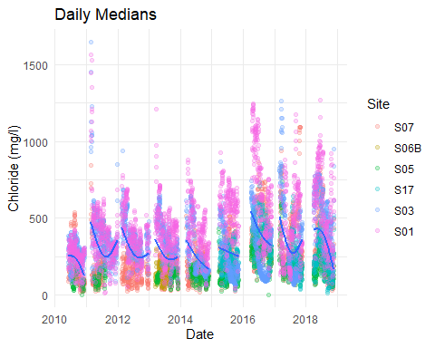

Note that the smooth fits here really don’t make much sense, since the
data across multiple sites are combined, but it’s useful for assessing
whether the data is in the format we want. Still note the general
downward trend in most years.

# Data for Site 17

``` r
the_data <- full_data %>% filter(Site=='S17')
```

# Explore Autocorrelation Structure

Now that we have a zoo, we can look at autocorrelation and
crosscorrelation. But since we pull data out of the zoo objects using
coredata(), this is the same as running the analysis on a non-zoo
object. So these analysis don’t handle seasonal patterns or winter data
gaps correctly. These are preliminary analyses only.

``` r
oldpar <- par(mfrow=c(2,3), mar = c(1,2,3,1))
acf(the_data$Precip, main = 'Precip', na.action= na.pass)
acf(the_data$D_Median, main='Depth', lag.max=100, na.action= na.pass)
acf(the_data$Chl_Median, main='Est. Chloride (mg/l)', lag.max=100, na.action=na.pass)
pacf(the_data$Precip, main = 'Precip', na.action= na.pass)
pacf(the_data$D_Median, main='Depth', lag.max=100, na.action= na.pass)
pacf(the_data$Chl_Median, main='Est. Chloride (mg/l)', lag.max=100, na.action=na.pass)
```

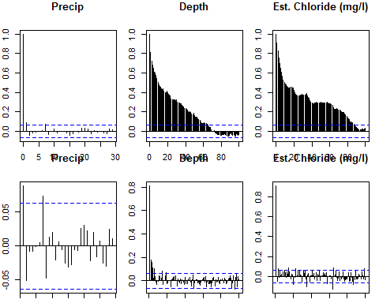

``` r
par(oldpar)
```

So, this suggests first order autoregressive process for the Chloride
and depth metrics. Precipitation would probably be better fit with a
first order moving average process. Prior work has shown similar
patterns looking at log-transformed values.

# Explore Cross Correlation Structure

``` r
oldpar <- par(mfrow=c(1,2), mar = c(1,2,3,1))
a <- ccf(the_data$Chl_Median, the_data$Precip, 
    main = 'Chloride by Precipitation',
    lag.max = 10,
    ylim = c(-.6,0.1), 
    na.action= na.pass)
b <- ccf(the_data$Chl_Median, the_data$D_Median, 
    main = 'Chloride by Depth',
    lag.max = 10,
    ylim = c(-.6, 0.1),
    na.action= na.pass)
```

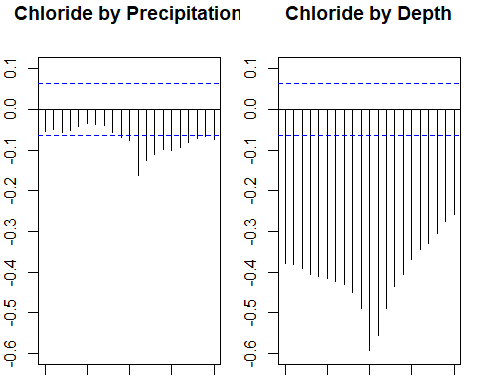

``` r
par(oldpar)
```

``` r
a[-2:10]
#> 
#> Autocorrelations of series 'X', by lag
#> 
#>     -2     -1      0      1      2      3      4      5      6      7      8 
#> -0.056 -0.070 -0.076 -0.163 -0.126 -0.111 -0.099 -0.100 -0.092 -0.081 -0.071 
#>      9     10 
#> -0.066 -0.074
b[-2:10]
#> 
#> Autocorrelations of series 'X', by lag
#> 
#>     -2     -1      0      1      2      3      4      5      6      7      8 
#> -0.450 -0.490 -0.594 -0.555 -0.490 -0.436 -0.405 -0.370 -0.345 -0.330 -0.304 
#>      9     10 
#> -0.276 -0.259
```

Chlorides are negatively correlated with rainfall. The connection is
only moderate with rainfall on the day of the observation, but stronger
with rainfall from several days before. We see significant correlations
going back about 10 days.

Chlorides are strongly (negatively) correlated with depth, with a peak
at a lag of zero. Correlations are nearly symmetrical for leading and
lagging depths.

# Log Linear Models

These models are technically incorrect, as they have autocorrelated
errors, but they allow us to select the right autocorrelation structure
as we move to more sophisticated models. While we’re at it, we explore
whether to treat seasonality by day of year or by month.

(Prior work showed that analysis of log transformed data better conforms
to model assumptions. We do not show similar models of untransformed
data here.)

## Weighted and Transformed Precipitation data

Note that `lprecip`, `wprecip`, and `wlprecip` were part of the the data
we imported. Code creating them can be found in the
`Make_Complete_Data.Rmd` notebook. They correspond to:  
\* `lprecip`: Log of Precip Data.  
\* `wprecip`: Weighted prior precipitation, weighted according to the
`expweights()` function.  
\* `wlprecip` Weighted logs of prior precipitation, weighted according
to the `expweights()` function.

Similarly, `lD_Median` is a term for the log of the daily median water
depth.

## Polynomial by Day of Year

Data from `Site == S17` has only been available since 2015, so we are
fitting only four years of data here (2015 through 2018).

``` r
Chl_llm_1 <- lm(log(Chl_Median) ~ Yearf + lPrecip +
                  wlPrecip + lD_Median +
                  poly(DOY,5), data = the_data,
                  na.action=na.omit)
summary(Chl_llm_1)
#> 
#> Call:
#> lm(formula = log(Chl_Median) ~ Yearf + lPrecip + wlPrecip + lD_Median + 
#>     poly(DOY, 5), data = the_data, na.action = na.omit)
#> 
#> Residuals:
#>      Min       1Q   Median       3Q      Max 
#> -2.04013 -0.15067  0.01782  0.15514  1.42815 
#> 
#> Coefficients:
#>                Estimate Std. Error t value Pr(>|t|)    
#> (Intercept)    5.946499   0.035409 167.937  < 2e-16 ***
#> Yearf2016      0.496672   0.029646  16.753  < 2e-16 ***
#> Yearf2017      0.033595   0.031168   1.078 0.281421    
#> Yearf2018      0.224026   0.031615   7.086 3.07e-12 ***
#> lPrecip       -0.024756   0.010793  -2.294 0.022065 *  
#> wlPrecip      -0.135894   0.009589 -14.172  < 2e-16 ***
#> lD_Median     -1.862046   0.172412 -10.800  < 2e-16 ***
#> poly(DOY, 5)1 -2.795118   0.650651  -4.296 1.96e-05 ***
#> poly(DOY, 5)2  0.156643   0.886241   0.177 0.859751    
#> poly(DOY, 5)3  0.384732   0.908362   0.424 0.672014    
#> poly(DOY, 5)4  2.606311   0.783693   3.326 0.000923 ***
#> poly(DOY, 5)5  0.100522   0.560911   0.179 0.857817    
#> ---
#> Signif. codes:  0 '***' 0.001 '**' 0.01 '*' 0.05 '.' 0.1 ' ' 1
#> 
#> Residual standard error: 0.2725 on 784 degrees of freedom
#>   (168 observations deleted due to missingness)
#> Multiple R-squared:  0.7294, Adjusted R-squared:  0.7257 
#> F-statistic: 192.2 on 11 and 784 DF,  p-value: < 2.2e-16
```

Chloride levels vary year to year, even after addressing precipitation
and depth. The time of year clearly does matter.

## Strictly Periodic (sine and cosine) fit.

``` r
Chl_llm_2 <- lm(log(Chl_Median) ~ Yearf + lPrecip + wlPrecip + lD_Median +
                  sin(2*pi*DOY/365) + cos(2*pi*DOY/365) +
                  sin(2*pi*DOY/(2*365)) + cos(2*pi*DOY/(2*365)),
                  data = the_data, na.action=na.omit)
summary(Chl_llm_2)
#> 
#> Call:
#> lm(formula = log(Chl_Median) ~ Yearf + lPrecip + wlPrecip + lD_Median + 
#>     sin(2 * pi * DOY/365) + cos(2 * pi * DOY/365) + sin(2 * pi * 
#>     DOY/(2 * 365)) + cos(2 * pi * DOY/(2 * 365)), data = the_data, 
#>     na.action = na.omit)
#> 
#> Residuals:
#>      Min       1Q   Median       3Q      Max 
#> -2.02942 -0.15187  0.01717  0.15657  1.43591 
#> 
#> Coefficients:
#>                             Estimate Std. Error t value Pr(>|t|)    
#> (Intercept)                  9.53849    0.65882  14.478  < 2e-16 ***
#> Yearf2016                    0.49578    0.02961  16.745  < 2e-16 ***
#> Yearf2017                    0.03047    0.03085   0.988  0.32364    
#> Yearf2018                    0.22243    0.03152   7.056 3.76e-12 ***
#> lPrecip                     -0.02519    0.01077  -2.339  0.01958 *  
#> wlPrecip                    -0.13648    0.00957 -14.261  < 2e-16 ***
#> lD_Median                   -1.86637    0.17195 -10.854  < 2e-16 ***
#> sin(2 * pi * DOY/365)       -0.39589    0.15573  -2.542  0.01121 *  
#> cos(2 * pi * DOY/365)       -1.64422    0.25695  -6.399 2.69e-10 ***
#> sin(2 * pi * DOY/(2 * 365)) -5.12711    0.90620  -5.658 2.15e-08 ***
#> cos(2 * pi * DOY/(2 * 365))  0.78858    0.25931   3.041  0.00244 ** 
#> ---
#> Signif. codes:  0 '***' 0.001 '**' 0.01 '*' 0.05 '.' 0.1 ' ' 1
#> 
#> Residual standard error: 0.2722 on 785 degrees of freedom
#>   (168 observations deleted due to missingness)
#> Multiple R-squared:  0.7298, Adjusted R-squared:  0.7263 
#> F-statistic:   212 on 10 and 785 DF,  p-value: < 2.2e-16
```

Fitting a seasonal pattern by sine and cosine functions again shows time
of year matters. A periodic fit changes other coefficients (for year,
precipitation, and depth) only slightly, suggesting the exact form of
the seasonal fit may not much alter the types of long-term trends we
observe.

## Genealized Addative Model Fit

``` r
Chl_llm_3 <- gam(log(Chl_Median) ~ Yearf + lPrecip +
                  wlPrecip + lD_Median +
                  s(DOY, k=6), data = the_data,   # k here is arbitrary, to get 
                                                  # a fairly simple curve
                  na.action=na.omit)
summary(Chl_llm_3)
#> 
#> Family: gaussian 
#> Link function: identity 
#> 
#> Formula:
#> log(Chl_Median) ~ Yearf + lPrecip + wlPrecip + lD_Median + s(DOY, 
#>     k = 6)
#> 
#> Parametric coefficients:
#>              Estimate Std. Error t value Pr(>|t|)    
#> (Intercept)  5.941536   0.031442 188.970  < 2e-16 ***
#> Yearf2016    0.494069   0.029601  16.691  < 2e-16 ***
#> Yearf2017    0.026694   0.031047   0.860   0.3902    
#> Yearf2018    0.220725   0.031536   6.999 5.53e-12 ***
#> lPrecip     -0.025674   0.010763  -2.385   0.0173 *  
#> wlPrecip    -0.137258   0.009575 -14.335  < 2e-16 ***
#> lD_Median   -1.870617   0.171649 -10.898  < 2e-16 ***
#> ---
#> Signif. codes:  0 '***' 0.001 '**' 0.01 '*' 0.05 '.' 0.1 ' ' 1
#> 
#> Approximate significance of smooth terms:
#>         edf Ref.df     F p-value    
#> s(DOY) 4.67  4.947 24.77  <2e-16 ***
#> ---
#> Signif. codes:  0 '***' 0.001 '**' 0.01 '*' 0.05 '.' 0.1 ' ' 1
#> 
#> R-sq.(adj) =  0.727   Deviance explained = 73.1%
#> GCV = 0.075026  Scale est. = 0.073926  n = 796
```

And using a generalized linear model again has little effect on our
conclusions about the non-seasonal model parameters.

## Seasons by Month, not Day of Year

``` r
Chl_llm_4 <- lm(log(Chl_Median) ~ Yearf + lPrecip +
                  wlPrecip + lD_Median +
                  Month, data = the_data,
                  na.action=na.omit)
summary(Chl_llm_4)
#> 
#> Call:
#> lm(formula = log(Chl_Median) ~ Yearf + lPrecip + wlPrecip + lD_Median + 
#>     Month, data = the_data, na.action = na.omit)
#> 
#> Residuals:
#>      Min       1Q   Median       3Q      Max 
#> -1.99816 -0.14147  0.00334  0.15250  1.49891 
#> 
#> Coefficients:
#>              Estimate Std. Error t value Pr(>|t|)    
#> (Intercept)  5.785444   0.165781  34.898  < 2e-16 ***
#> Yearf2016    0.492557   0.029764  16.549  < 2e-16 ***
#> Yearf2017    0.020618   0.031423   0.656   0.5119    
#> Yearf2018    0.214805   0.031760   6.763 2.64e-11 ***
#> lPrecip     -0.024430   0.010821  -2.258   0.0242 *  
#> wlPrecip    -0.140213   0.009775 -14.344  < 2e-16 ***
#> lD_Median   -1.836363   0.171386 -10.715  < 2e-16 ***
#> MonthApr     0.275260   0.163644   1.682   0.0930 .  
#> MonthMay     0.189807   0.162216   1.170   0.2423    
#> MonthJun     0.247480   0.162530   1.523   0.1282    
#> MonthJul     0.289529   0.163310   1.773   0.0766 .  
#> MonthAug     0.152178   0.163259   0.932   0.3516    
#> MonthSep     0.004160   0.162632   0.026   0.9796    
#> MonthOct    -0.004123   0.162093  -0.025   0.9797    
#> MonthNov     0.152184   0.162758   0.935   0.3501    
#> ---
#> Signif. codes:  0 '***' 0.001 '**' 0.01 '*' 0.05 '.' 0.1 ' ' 1
#> 
#> Residual standard error: 0.2729 on 781 degrees of freedom
#>   (168 observations deleted due to missingness)
#> Multiple R-squared:  0.7297, Adjusted R-squared:  0.7249 
#> F-statistic: 150.6 on 14 and 781 DF,  p-value: < 2.2e-16
```

This slightly lowers our estimates of precipitation and depth
parameters.

``` r
anova(Chl_llm_2, Chl_llm_3, Chl_llm_1, Chl_llm_4)
#> Analysis of Variance Table
#> 
#> Model 1: log(Chl_Median) ~ Yearf + lPrecip + wlPrecip + lD_Median + sin(2 * 
#>     pi * DOY/365) + cos(2 * pi * DOY/365) + sin(2 * pi * DOY/(2 * 
#>     365)) + cos(2 * pi * DOY/(2 * 365))
#> Model 2: log(Chl_Median) ~ Yearf + lPrecip + wlPrecip + lD_Median + s(DOY, 
#>     k = 6)
#> Model 3: log(Chl_Median) ~ Yearf + lPrecip + wlPrecip + lD_Median + poly(DOY, 
#>     5)
#> Model 4: log(Chl_Median) ~ Yearf + lPrecip + wlPrecip + lD_Median + Month
#>   Res.Df    RSS      Df Sum of Sq      F Pr(>F)  
#> 1 785.00 58.166                                  
#> 2 784.33 57.982 0.67002  0.183985 3.6864 0.0696 .
#> 3 784.00 58.232 0.32998 -0.249727                
#> 4 781.00 58.177 3.00000  0.055363 0.2477 0.8630  
#> ---
#> Signif. codes:  0 '***' 0.001 '**' 0.01 '*' 0.05 '.' 0.1 ' ' 1
```

``` r
AIC( Chl_llm_2, Chl_llm_3, Chl_llm_1,  Chl_llm_4)
#>                 df      AIC
#> Chl_llm_2 12.00000 200.3832
#> Chl_llm_3 12.67002 199.2015
#> Chl_llm_1 13.00000 203.2824
#> Chl_llm_4 16.00000 208.5253
```

The sine and cosine model is the best both by residual sums of squares,
and by AIC, but the differences are small. The GAM model can be improved
by allowing higher degrees of freedom for the seasonal curve. Use of
GAMM also allows easier model development.

The GAM fit needs to be tuned to avoid generating a very wiggly line.
Here, we’ve fit a GAM that has about the same degrees of freedom as the
polynomial fit. What did that smooth look like? (Note that the degree of
wiggliness will change as we move towards better models).

``` r
plot(Chl_llm_3)
```

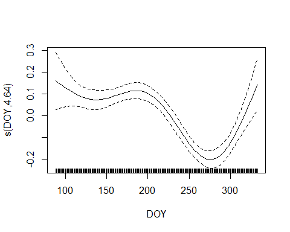

## Autocorrelation of residuals

This is a partially incorrect analysis, because ACF and PACF don’t
handle missing values correctly. Still, given the richness of our data,
it is adequate for our current question.

``` r
oldpar <- par(mfrow=c(1,2),mar = c(1,2,3,2))

r <- resid(Chl_llm_3)

acf(r, na.action=na.omit, main= 'Model Residuals')
pacf(r, na.action=na.omit, main= 'Model Residuals')
```

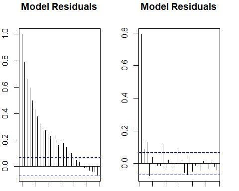

``` r
par<-oldpar
```

``` r
rm(Chl_llm_1, Chl_llm_2, Chl_llm_3, Chl_llm_4)
```

## Examining Autocorrelation of Residuals

``` r
a<-acf(r, na.action=na.omit, main= 'Model Residuals', plot=FALSE)
(theautocor <- a$acf[2])
#> [1] 0.7919441
```

So we can use an auto regressive model of degree one, with a correlation
near 0.8.

# Generalized Least Squares

The simplest way to handle autocorrelated errors is with generalized
least squares. This is a simple version of this model, without
interactions, and using a fifth degree polynomial to capture the
seasonal effect.

``` r
the_gls <- gls(log(Chl_Median) ~ Yearf + lPrecip + wlPrecip + lD_Median +
                 poly(DOY,3), data = the_data, na.action=na.omit,
                 correlation=corAR1(0.8))
summary(the_gls)
#> Generalized least squares fit by REML
#>   Model: log(Chl_Median) ~ Yearf + lPrecip + wlPrecip + lD_Median + poly(DOY,      3) 
#>   Data: the_data 
#>         AIC       BIC   logLik
#>   -627.6377 -571.6343 325.8189
#> 
#> Correlation Structure: AR(1)
#>  Formula: ~1 
#>  Parameter estimate(s):
#>       Phi 
#> 0.8484855 
#> 
#> Coefficients:
#>                   Value Std.Error   t-value p-value
#> (Intercept)    5.978802 0.0797712  74.94941  0.0000
#> Yearf2016      0.485303 0.0974751   4.97874  0.0000
#> Yearf2017      0.064246 0.1005606   0.63888  0.5231
#> Yearf2018      0.324886 0.1066033   3.04761  0.0024
#> lPrecip       -0.009921 0.0063049  -1.57352  0.1160
#> wlPrecip      -0.104439 0.0100351 -10.40737  0.0000
#> lD_Median     -2.571378 0.1129370 -22.76824  0.0000
#> poly(DOY, 3)1 -2.396019 0.8117233  -2.95177  0.0033
#> poly(DOY, 3)2  0.972223 0.9361413   1.03854  0.2993
#> poly(DOY, 3)3  1.558122 0.7403107   2.10469  0.0356
#> 
#>  Correlation: 
#>               (Intr) Yr2016 Yr2017 Yr2018 lPrecp wlPrcp lD_Mdn p(DOY,3)1
#> Yearf2016     -0.741                                                    
#> Yearf2017     -0.667  0.541                                             
#> Yearf2018     -0.735  0.593  0.562                                      
#> lPrecip       -0.071  0.000 -0.011 -0.008                               
#> wlPrecip      -0.103  0.005 -0.028 -0.015  0.676                        
#> lD_Median     -0.113  0.042 -0.021 -0.065 -0.444 -0.534                 
#> poly(DOY, 3)1 -0.056  0.065  0.017  0.079 -0.008 -0.016  0.012          
#> poly(DOY, 3)2  0.255 -0.399  0.017 -0.285  0.035  0.047 -0.100 -0.015   
#> poly(DOY, 3)3 -0.052 -0.020 -0.034  0.178 -0.009 -0.042  0.008 -0.528   
#>               p(DOY,3)2
#> Yearf2016              
#> Yearf2017              
#> Yearf2018              
#> lPrecip                
#> wlPrecip               
#> lD_Median              
#> poly(DOY, 3)1          
#> poly(DOY, 3)2          
#> poly(DOY, 3)3 -0.041   
#> 
#> Standardized residuals:
#>         Min          Q1         Med          Q3         Max 
#> -6.69128071 -0.51755903 -0.03470126  0.44842346  5.88052507 
#> 
#> Residual standard error: 0.2997056 
#> Degrees of freedom: 796 total; 786 residual
```

The correlations among parameters suggest the interdependence of the
Year factors, which is expected. Negative correlations among depth and
the precipitation variables also makes sense. We expect depth to be
correlated with precipitation variables, so the negative correlation
among the parameters is expected. If one parameter goes up, the ideal
fit for the other should go down.

Note that this model fits a SEQUENTIAL autocorrelation function, not an
indexed autocorrelation function. That is, this is not a fully
time-aware model. We still need to account for annual breaks in
coverage, or otherwise handle that.

``` r
anova(the_gls)
#> Denom. DF: 786 
#>              numDF   F-value p-value
#> (Intercept)      1 22584.876  <.0001
#> Yearf            3    32.265  <.0001
#> lPrecip          1     8.938  0.0029
#> wlPrecip         1   713.685  <.0001
#> lD_Median        1   517.919  <.0001
#> poly(DOY, 3)     3     3.398  0.0175
```

Notice that the effect of TODAY’s rainfall is not statistically
significant when judged by T test, but IS significant by ANOVA.

## Diagnostic Plots

``` r
plot(the_gls)
```

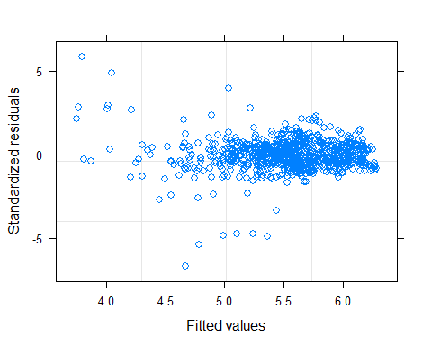

``` r
qqnorm(the_gls, abline=c(0,1))
```

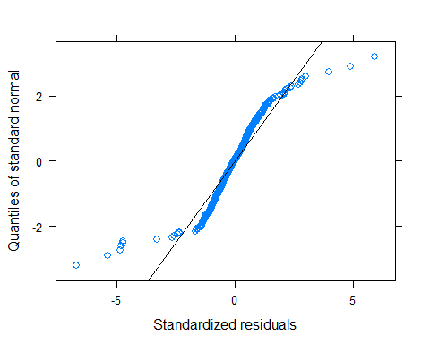

``` r
plot(the_gls, Yearf~resid(., type='p'))
```

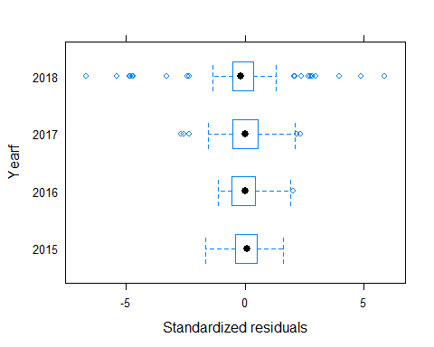

``` r
plot(the_gls, resid(., type='p')~DOY)
```

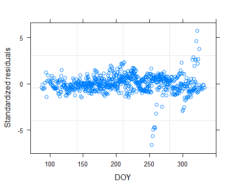

``` r
plot(the_gls, resid(., type='p')~lPrecip)
```

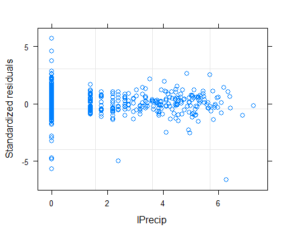
Extreme residuals are a problem. They mostly correspond to low values
observed in 2018 over a period of a few days. They may affect our
models, but probably not excessively. We should consider measures of
statistical significance with care.

# Generalized Linear Models

The gamm() function in the mcgv package handles GAMs with an `ar1()`
autocorrelation quite handily. There are a large number of potential
model structures that we might want to use here, so I explore many of
them here.

We use `method = 'ML'' while exploring models, because the fixed
components of the models change under 'REML', so comparing models
produced with`method = ‘REML’\` would generate nonsense. After selecting
a model, we refit the model with REML to improve performance.

We start by fitting simple models with only a single GAM term for the
Day of the Year. This gives us a way to explore other components of
model structure.

Note that as we move towards a GAM fit with an AR1 term, the optimal
smoothed fit for Day of Year changes.

## Basic Model Sequence

These are a basic series of (nested) interaction models, which we can
compare by ANOVA or AIC. Here we are trying to select the preferred
interaction structure among our precipitation related predictor
variables.

There is some ambiguity here on whether to fit cyclic cubic splines with
`bs = 'cc'` or not. We chose not to, as we do not have full 365 day
annual records. In other words, there is a gap in time between the end
of one year’s data and the beginning of the following year’s data.
Forcing a cyclic smoother under those circumstances makes a possibly
unwarranted assumption about continuity across the winter break in
monitoring.

``` r
# No Interactions
gam_fit_1 <- gamm(log(Chl_Median) ~ Yearf + 
                    lPrecip + 
                    wlPrecip + 
                    lD_Median +
                s(DOY),
                data = the_data, na.action=na.omit, method='ML',
                correlation=corAR1(0.8))

# Weighted precipitation by depth interaction only
gam_fit_2 <- gamm(log(Chl_Median) ~ Yearf + 
                  lPrecip + 
                  wlPrecip * lD_Median +
                s(DOY),
                data = the_data, na.action=na.omit, method='ML',
                correlation=corAR1(0.8))

# Both precipitation by depth interactions
gam_fit_3 <- gamm(log(Chl_Median) ~ Yearf + 
                    lPrecip + 
                    wlPrecip + 
                    lD_Median +
                    lPrecip:lD_Median +
                    wlPrecip:lD_Median +
                    s(DOY),
                  data = the_data, na.action=na.omit, method='ML',
                  correlation=corAR1(0.8))

# Both precipitation by depth interactions, as well as current precipitation
# by weighted past precipitation interactions.
gam_fit_4 <- gamm(log(Chl_Median) ~ Yearf + 
                    (lPrecip + wlPrecip + lD_Median)^2 +
                    s(DOY),
                  data = the_data, na.action=na.omit, method='ML',
                  correlation=corAR1(0.8))

# Add the three way interaction.
gam_fit_5 <- gamm(log(Chl_Median) ~ Yearf + 
                    lPrecip * wlPrecip * lD_Median +
                    s(DOY),
                  data = the_data, na.action=na.omit, method='ML',
                  correlation=corAR1(0.8))
```

Comparing these models, it is clear that interaction terms help with
model fitting. That is probably not unreasonable, since today’s rainfall
could well interact with yesterday’s rainfall or the current water depth
in complex ways.

``` r
anova(gam_fit_1$lme, gam_fit_2$lme, gam_fit_3$lme, gam_fit_4$lme, gam_fit_5$lme)
#>               Model df       AIC       BIC   logLik   Test  L.Ratio p-value
#> gam_fit_1$lme     1 11 -653.4984 -602.0228 337.7492                        
#> gam_fit_2$lme     2 12 -651.4995 -595.3443 337.7498 1 vs 2  0.00114  0.9731
#> gam_fit_3$lme     3 13 -690.1336 -629.2988 358.0668 2 vs 3 40.63407  <.0001
#> gam_fit_4$lme     4 14 -690.1214 -624.6070 359.0607 3 vs 4  1.98779  0.1586
#> gam_fit_5$lme     5 15 -695.4101 -625.2161 362.7050 4 vs 5  7.28870  0.0069
```

Models 3,4, and 5 provide very similar (not statistically significant)
differences in performance by AIC or Log likelihood. Model 4 is SLIGHTLY
better by AIC, model 3 by BIC.

From a practical point of view, given our goals (to facilitate detection
of differences among years), any of the last three models are
functionally similar. We like model 3, because of its parsimony.

Note that having done a better job of the flow characteristics, the GAM
term comes back as a linear function of time of year. That is because
the `mgcv` package implements thin-plate splines, by default, which
“shrink” the spline fit, and reduce degrees of freedom. That means
weare functionally fitting a simple linear model here.

``` r
plot(gam_fit_3$gam, main="Thin  Plate Spline")
```

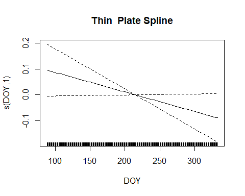

``` r
gls_fit_3 <- gls(log(Chl_Median) ~ Yearf + DOY +
                    lPrecip + 
                    wlPrecip + 
                    lD_Median +
                    lPrecip:lD_Median +
                    wlPrecip:lD_Median,
                  data = the_data, na.action=na.omit, method='ML',
                  correlation=corAR1(0.8))
```

``` r
AIC(gls_fit_3)
#> [1] -692.1336
anova(gls_fit_3)
#> Denom. DF: 786 
#>                    numDF   F-value p-value
#> (Intercept)            1 21244.278  <.0001
#> Yearf                  3    32.331  <.0001
#> DOY                    1     8.116  0.0045
#> lPrecip                1     9.294  0.0024
#> wlPrecip               1   739.213  <.0001
#> lD_Median              1   546.101  <.0001
#> lPrecip:lD_Median      1    30.552  <.0001
#> wlPrecip:lD_Median     1    10.986  0.0010
```

``` r
anova(gam_fit_3$gam)
#> 
#> Family: gaussian 
#> Link function: identity 
#> 
#> Formula:
#> log(Chl_Median) ~ Yearf + lPrecip + wlPrecip + lD_Median + lPrecip:lD_Median + 
#>     wlPrecip:lD_Median + s(DOY)
#> 
#> Parametric Terms:
#>                    df     F  p-value
#> Yearf               3 16.79 1.41e-10
#> lPrecip             1 14.69 0.000137
#> wlPrecip            1 34.77 5.50e-09
#> lD_Median           1 48.95 5.64e-12
#> lPrecip:lD_Median   1 41.58 1.97e-10
#> wlPrecip:lD_Median  1 11.00 0.000953
#> 
#> Approximate significance of smooth terms:
#>        edf Ref.df     F p-value
#> s(DOY)   1      1 3.627  0.0572
```

There is some evidence or problems with colinearity here, where
hydraulic variables and time of year are intercorrelated.

``` r
p1 <- predict(gls_fit_3)
formula(gls_fit_3)
#> log(Chl_Median) ~ Yearf + DOY + lPrecip + wlPrecip + lD_Median + 
#>     lPrecip:lD_Median + wlPrecip:lD_Median
#> <environment: 0x0000000028dd4d40>
p2 <- predict(gam_fit_1$gam)
formula(gam_fit_1$gam)
#> log(Chl_Median) ~ Yearf + lPrecip + wlPrecip + lD_Median + s(DOY)
p3 <- predict(gam_fit_3$gam)
formula(gam_fit_3$gam)
#> log(Chl_Median) ~ Yearf + lPrecip + wlPrecip + lD_Median + lPrecip:lD_Median + 
#>     wlPrecip:lD_Median + s(DOY)
p4 <- predict(gam_fit_4$gam)
formula(gam_fit_4$gam)
#> log(Chl_Median) ~ Yearf + (lPrecip + wlPrecip + lD_Median)^2 + 
#>     s(DOY)
p5 <- predict(gam_fit_5$gam)
formula(gam_fit_5$gam)
#> log(Chl_Median) ~ Yearf + lPrecip * wlPrecip * lD_Median + s(DOY)
```

``` r
cor(cbind(p1, p2,p3,p4,p5))
#>           p1        p2        p3        p4        p5
#> p1 1.0000000 0.9955140 1.0000000 0.9998997 0.9995551
#> p2 0.9955140 1.0000000 0.9955140 0.9951448 0.9959653
#> p3 1.0000000 0.9955140 1.0000000 0.9998997 0.9995551
#> p4 0.9998997 0.9951448 0.9998997 1.0000000 0.9995966
#> p5 0.9995551 0.9959653 0.9995551 0.9995966 1.0000000
```

So, all models are providing predictions with better than 99.5%
correlations.

The GLS and Model 3 are equivalent.

For most purposes, we should probably select for parsimony. Note
especially that the GLS fit is correlated at over 99% with each of the
GAM models.

``` r
rm(gam_fit_1, gam_fit_2, gam_fit_3, gam_fit_4, gam_fit_5)
rm(p1, p2, p3, p4, p5)
```

## Refining the Model

We continue fitting models based on Model 3, testing additional possible
GAM components in place of linear and interaction terms.

IN normal linear models, one does not include an interaction term
without also including both main effects to which it contributes (with
some exceptions). The equivalent constraint here is to not include an
“interaction” tensor smooth (with function `ti()`) without including
the associated “main effects” tensor components too. If one only wants
to construct the combined smooth without testing the structure of the
interaction, you can do so with tyhe function `te()`.

But then we face a problem if we want linear interactions with one
predictor and smoothed interaction with another. On some level, that
makes mathematical sense, but may not be interpretable. Her we stick to
either fitting smoothed or linear terms related to each predictor.

``` r
# Linear Interactions (same as prior model 3)
gam_fit_3.1 <- gamm(log(Chl_Median) ~ Yearf + 
                      lPrecip + 
                      wlPrecip + 
                      lD_Median +
                      lPrecip:lD_Median +
                      wlPrecip:lD_Median +
                      s(DOY),
                data = the_data, na.action=na.omit, method='ML',
                correlation=corAR1(0.8))

# Smooth current depth; linear interaction past precip and depth
gam_fit_3.2 <- gamm(log(Chl_Median) ~ Yearf +
                      lPrecip + 
                      wlPrecip +
                      wlPrecip:lD_Median +
                      s(lD_Median)+ 
                      s(DOY),
                 data = the_data, na.action=na.omit, method='ML',
                 correlation=corAR1(0.8))

# Smooth current depth; linear interaction current precip and depth
gam_fit_3.3 <- gamm(log(Chl_Median) ~ Yearf + 
                      lPrecip + 
                      wlPrecip + 
                      lPrecip:lD_Median +
                      s(lD_Median)+ 
                      s(DOY),
                 data = the_data, na.action=na.omit, method='ML',
                 correlation=corAR1(0.8))

# Smooth depth, Precipitation and their interaction.
# and depth
gam_fit_3.4 <- gamm(log(Chl_Median) ~ Yearf + 
                        wlPrecip + 
                        ti(lPrecip) +
                        ti(lD_Median) + 
                        ti(lPrecip, lD_Median) +
                        s(DOY),
                 data = the_data, na.action=na.omit, method='ML',
                 correlation=corAR1(0.8))

# Smooth depth, past Precipitation and their interaction
gam_fit_3.5 <- gamm(log(Chl_Median) ~ Yearf + 
                        lPrecip + 
                        ti(wlPrecip) +
                        ti(lD_Median)+ 
                        ti(wlPrecip, lD_Median) +
                        s(DOY),
                 data = the_data, na.action=na.omit, method='ML',
                 correlation=corAR1(0.8))

# Interaction smooths
gam_fit_3.6 <- gamm(log(Chl_Median) ~ Yearf +
                      ti(lPrecip) +
                      ti(wlPrecip) +
                      ti(lD_Median) +
                      ti(lPrecip,  lD_Median)+
                      ti(wlPrecip, lD_Median) +
                      s(DOY),
                 data = the_data, na.action=na.omit, method='ML',
                 correlation=corAR1(0.8))
```

``` r
anova(gam_fit_3.1$lme, gam_fit_3.2$lme, gam_fit_3.3$lme, 
      gam_fit_3.4$lme,  gam_fit_3.5$lme, gam_fit_3.6$lme)
#>                 Model df       AIC       BIC   logLik   Test  L.Ratio p-value
#> gam_fit_3.1$lme     1 13 -690.1336 -629.2988 358.0668                        
#> gam_fit_3.2$lme     2 13 -682.3065 -621.4717 354.1533                        
#> gam_fit_3.3$lme     3 13 -698.1129 -637.2781 362.0565                        
#> gam_fit_3.4$lme     4 16 -765.2922 -690.4186 398.6461 3 vs 4 73.17927  <.0001
#> gam_fit_3.5$lme     5 16 -698.0753 -623.2017 365.0376                        
#> gam_fit_3.6$lme     6 20 -786.4855 -692.8935 413.2427 5 vs 6 96.41018  <.0001
```

So, model 3.4 and 3.6 are the best, and they are also better than the
(linear) GLS fit, which has AIC = -636.8369.

## A Closer Look at the Full Model

``` r
summary(gam_fit_3.6$gam)
#> 
#> Family: gaussian 
#> Link function: identity 
#> 
#> Formula:
#> log(Chl_Median) ~ Yearf + ti(lPrecip) + ti(wlPrecip) + ti(lD_Median) + 
#>     ti(lPrecip, lD_Median) + ti(wlPrecip, lD_Median) + s(DOY)
#> 
#> Parametric coefficients:
#>             Estimate Std. Error t value Pr(>|t|)    
#> (Intercept)  5.30814    0.07897  67.213  < 2e-16 ***
#> Yearf2016    0.54640    0.08993   6.076 1.93e-09 ***
#> Yearf2017    0.11230    0.10314   1.089  0.27661    
#> Yearf2018    0.31433    0.10676   2.944  0.00333 ** 
#> ---
#> Signif. codes:  0 '***' 0.001 '**' 0.01 '*' 0.05 '.' 0.1 ' ' 1
#> 
#> Approximate significance of smooth terms:
#>                          edf Ref.df      F  p-value    
#> ti(lPrecip)            3.854  3.854  8.023 2.73e-06 ***
#> ti(wlPrecip)           1.000  1.000 43.525  < 2e-16 ***
#> ti(lD_Median)          3.530  3.530 69.557  < 2e-16 ***
#> ti(lPrecip,lD_Median)  2.775  2.775 36.808  < 2e-16 ***
#> ti(wlPrecip,lD_Median) 1.466  1.466 20.314 8.05e-07 ***
#> s(DOY)                 1.000  1.000  5.125   0.0239 *  
#> ---
#> Signif. codes:  0 '***' 0.001 '**' 0.01 '*' 0.05 '.' 0.1 ' ' 1
#> 
#> R-sq.(adj) =  0.711   
#>   Scale est. = 0.084617  n = 796
```

According to that, all three smooth terms and both interaction terms are
significant, and should be retained in the model. But this leads to a
complex model that will be slow to fit when we look at all sites.

``` r
plot(gam_fit_3.6$gam)
```

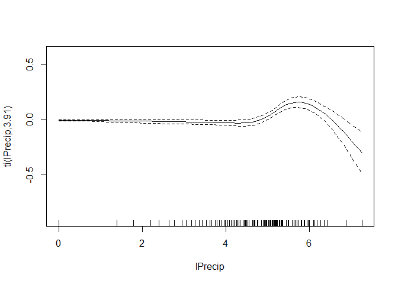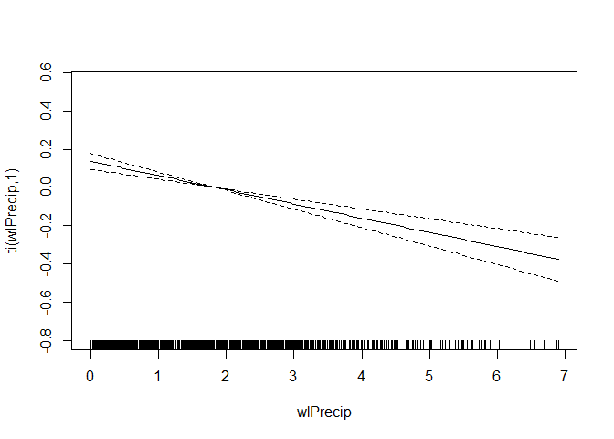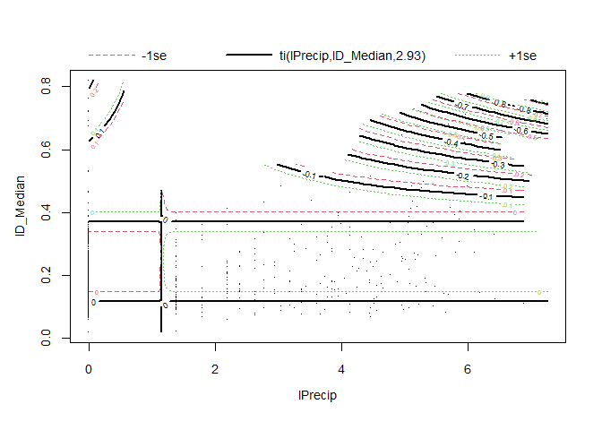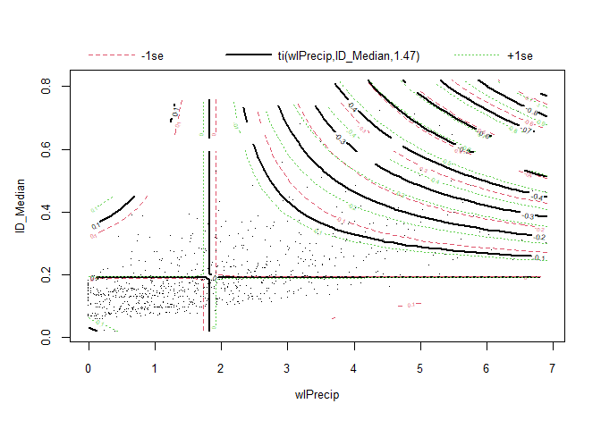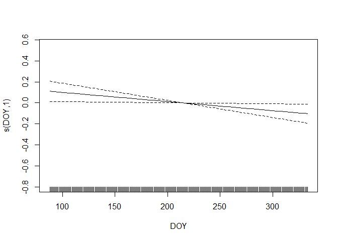
So current precipitation matters, but only for high values of current
precipitation. lPrecip = log(1 + x) for x = Precip, so values at log(6),
where rainfall appears to matter, correspond to about 403.4287935 tenths
of millimeters of rainfall, or about 4 cm, close to one and one half
inches.

Historic rainfall matters, across all levels, but is adequately modeled
by a linear function.

Stream depth is an important predictor, except at high depths.

The interaction terms are hard to address. Depth by precipitation
matters for high rainfall on days of deep water, or conversely, low
rainfall on days of high water. Dilution? Snow melt?

There is less and less of an effect of high historic rainfall as stream
depth increases.

### Model Checks

``` r
gam.check(gam_fit_3.6$gam)
```

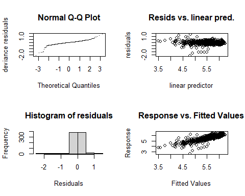

    #> 
    #> 'gamm' based fit - care required with interpretation.
    #> Checks based on working residuals may be misleading.
    #> Basis dimension (k) checking results. Low p-value (k-index<1) may
    #> indicate that k is too low, especially if edf is close to k'.
    #> 
    #>                           k'   edf k-index p-value    
    #> ti(lPrecip)             4.00  3.85    0.49  <2e-16 ***
    #> ti(wlPrecip)            4.00  1.00    0.97    0.20    
    #> ti(lD_Median)           4.00  3.53    0.89  <2e-16 ***
    #> ti(lPrecip,lD_Median)  16.00  2.77    0.85  <2e-16 ***
    #> ti(wlPrecip,lD_Median) 16.00  1.47    0.85  <2e-16 ***
    #> s(DOY)                  9.00  1.00    1.06    0.96    
    #> ---
    #> Signif. codes:  0 '***' 0.001 '**' 0.01 '*' 0.05 '.' 0.1 ' ' 1

Both historic water level and day of year can be adequately modeled as
linear functions. But if we go that route, we can not fit full GAM
interactions using tensor products.

Looking at residuals, we again have very heavy tails. That is
problematic. We are lucky that the high residual terms do not appear to
have high leverage. Note that in this model, once we address
precipitation and depth, time of year is also adequately modeled with a
linear function.

# Revised Models

Taking those lessons, we drop the smoothing term for Day of Year and
historic precipitation, and combine the other smoothed terms. This
produces models that are similar to 3.4, which was our second-best
performing model.

We also test use of different ways of defining smoothing terms using
classic smooths (`s()`), tensor product smooths (`te()`) and independent
tensor product smooths (`ti()`) to specify (conceptually) similar
models. They turn out to not be as similar as we thought.

This first model simply takes 3.4 and shifts the DOY term to linear
predictor. Since 3.4 settled on a linear predictor for the smoothed DOY
term, the predictions, and thus log likelihood are identical, but we
save a degree of freedom

``` r
gam_fit_3.7 <- gamm(log(Chl_Median) ~ Yearf +
                      wlPrecip +
                      DOY +
                      ti(lPrecip) +
                      ti(lD_Median) + 
                      ti(lPrecip, lD_Median),
                 data = the_data, na.action=na.omit, method='ML',
                 correlation=corAR1(0.8))
```

Note that all three tensor smooth terms are important.

``` r
anova(gam_fit_3.7$gam)
#> 
#> Family: gaussian 
#> Link function: identity 
#> 
#> Formula:
#> log(Chl_Median) ~ Yearf + wlPrecip + DOY + ti(lPrecip) + ti(lD_Median) + 
#>     ti(lPrecip, lD_Median)
#> 
#> Parametric Terms:
#>          df      F  p-value
#> Yearf     3 16.167 3.35e-10
#> wlPrecip  1 92.639  < 2e-16
#> DOY       1  5.908   0.0153
#> 
#> Approximate significance of smooth terms:
#>                         edf Ref.df       F  p-value
#> ti(lPrecip)           3.816  3.816   8.615 2.81e-06
#> ti(lD_Median)         3.644  3.644 105.440  < 2e-16
#> ti(lPrecip,lD_Median) 6.857  6.857  11.513  < 2e-16
```

``` r
plot(gam_fit_3.7$gam)
```

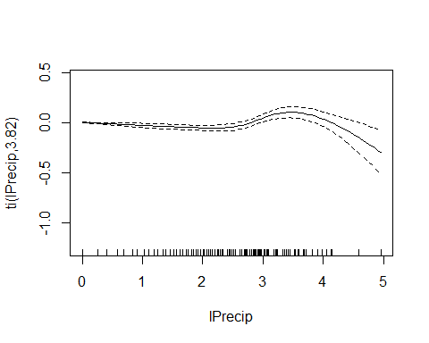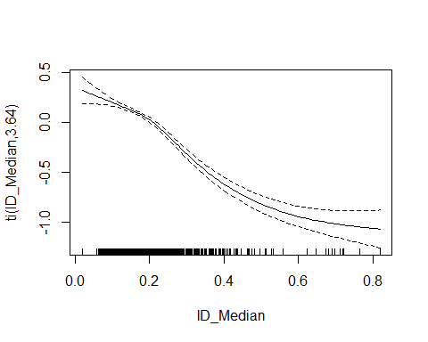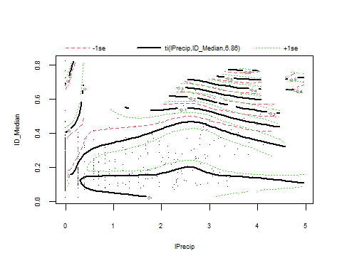

Depth could ALMOST be replaced by a linear function here.

This next model takes the prior model (3.7), and replaces the three
independent tensor smooths with a single joint tensor smoother. However,
predictions are not identical, producing a slightly lower log
likelihood. Online comments from stats.stackexchange:

<https://stats.stackexchange.com/questions/234809/r-mgcv-why-do-te-and-ti-tensor-products-produce-different-surfaces>

suggest the reason is that the underlying fitting strategy differs, with
more penalty matrices used to estimate more smoothing terms for the
tensor interaction models. Comments in that same thread suggest it is
reasonable to go with a combined tensor model when examination of the
tensor interaction model suggests a joint smooth is needed,as here.

``` r
gam_fit_3.8 <- gamm(log(Chl_Median) ~ Yearf +
                      wlPrecip +
                      DOY +
                      te(lPrecip,  lD_Median),
                 data = the_data, na.action=na.omit, method='ML',
                 correlation=corAR1(0.8))
```

Finally, we generate a similar joint smoother that is NOT a tensor
smooth. This effectively scales the smoother identically in both
dimensions, which is suboptimal where depth and precipitation are in
different (although log) units.

``` r
gam_fit_3.9 <- gamm(log(Chl_Median) ~ Yearf +
                      wlPrecip +
                      DOY +
                      s(lPrecip,  lD_Median),
                 data = the_data, na.action=na.omit, method='ML',
                 correlation=corAR1(0.8))
```

``` r
anova(gam_fit_3.4$lme, gam_fit_3.7$lme,  gam_fit_3.8$lme,  gam_fit_3.9$lme)
#>                 Model df       AIC       BIC   logLik   Test  L.Ratio p-value
#> gam_fit_3.4$lme     1 16 -765.2922 -690.4186 398.6461                        
#> gam_fit_3.7$lme     2 15 -767.2922 -697.0982 398.6461 1 vs 2  0.00000  0.9996
#> gam_fit_3.8$lme     3 13 -766.4020 -705.5672 396.2010 2 vs 3  4.89016  0.0867
#> gam_fit_3.9$lme     4 11 -752.8197 -701.3441 387.4099 3 vs 4 17.58232  0.0002
```

Model 3.7 is the “best” model by AIC, and 3.8 is the “best” by BIC. The
only difference is in how we fit the smoothed term. In our intended use
(looking at multiple sites), we won’t check the importance of sub-terms,
so it makes sense to use a model of the form of 3.8. That has the added
advantage of making it easier to understand the form of the bivariate
smoothing function.

``` r
plot(gam_fit_3.8$gam)
```

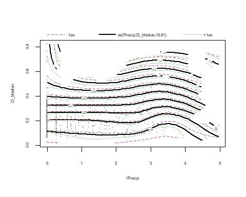

Again, that emphasizes that effect of strra mdepth is nearly linear.

## Compare Predictions

``` r
p4 <- predict(gam_fit_3.4$gam)
formula(gam_fit_3.4$gam)
#> log(Chl_Median) ~ Yearf + wlPrecip + ti(lPrecip) + ti(lD_Median) + 
#>     ti(lPrecip, lD_Median) + s(DOY)
p5 <- predict(gam_fit_3.5$gam)
formula(gam_fit_3.5$gam)
#> log(Chl_Median) ~ Yearf + lPrecip + ti(wlPrecip) + ti(lD_Median) + 
#>     ti(wlPrecip, lD_Median) + s(DOY)
p6 <- predict(gam_fit_3.6$gam)
formula(gam_fit_3.6$gam)
#> log(Chl_Median) ~ Yearf + ti(lPrecip) + ti(wlPrecip) + ti(lD_Median) + 
#>     ti(lPrecip, lD_Median) + ti(wlPrecip, lD_Median) + s(DOY)
p8 <- predict(gam_fit_3.8$gam)
formula(gam_fit_3.8$gam)
#> log(Chl_Median) ~ Yearf + wlPrecip + DOY + te(lPrecip, lD_Median)
```

``` r
cor(cbind(p4, p5, p6, p8))
#>           p4        p5        p6        p8
#> p4 1.0000000 0.9927963 0.9957100 0.9997131
#> p5 0.9927963 1.0000000 0.9942981 0.9931922
#> p6 0.9957100 0.9942981 1.0000000 0.9956240
#> p8 0.9997131 0.9931922 0.9956240 1.0000000
```

All of our predictions are highly correlated with each other, so it can
make little difference which model we choose.

``` r
plot(p8~p6, main='GAM 3.8 te(Precip x Depth) Compared to Full Model')
abline(0,1)
```

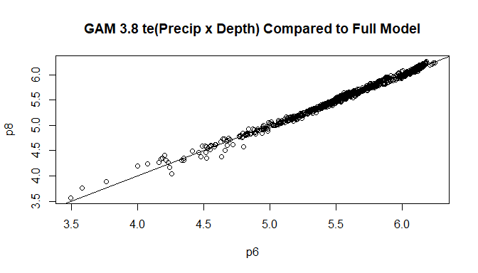

# Conclusion:

Best general model is 3.8. 3.6 is a slightly more general model. A fully
generalized model (three way tensor interaction) would also be valuable,
but would be likely to be slow to fit to our complete data.

``` r
formula(gam_fit_3.4$gam)
#> log(Chl_Median) ~ Yearf + wlPrecip + ti(lPrecip) + ti(lD_Median) + 
#>     ti(lPrecip, lD_Median) + s(DOY)
formula(gam_fit_3.8$gam)
#> log(Chl_Median) ~ Yearf + wlPrecip + DOY + te(lPrecip, lD_Median)
formula(gam_fit_3.6$gam)
#> log(Chl_Median) ~ Yearf + ti(lPrecip) + ti(wlPrecip) + ti(lD_Median) + 
#>     ti(lPrecip, lD_Median) + ti(wlPrecip, lD_Median) + s(DOY)
```

# Refit model using REML

``` r
gam_fit <- gamm(log(Chl_Median) ~ Yearf +
                      wlPrecip +
                      DOY +
                      te(lPrecip,  lD_Median),
                 data = the_data, na.action=na.omit, method='REML',
                 correlation=corAR1(0.8))
```

# And a similar GLS model

We add a quadratic term for the lD\_Median to allow for curvature of the
response, like what we saw in the GAM.

``` r
gls_fit <- gls(log(Chl_Median) ~ Yearf +  DOY +
               lPrecip + wlPrecip + lD_Median + 
               lPrecip:lD_Median,
               data = the_data, na.action=na.omit,
               correlation=corAR1(0.8))
```

``` r
summary(gls_fit)
#> Generalized least squares fit by REML
#>   Model: log(Chl_Median) ~ Yearf + DOY + lPrecip + wlPrecip + lD_Median +      lPrecip:lD_Median 
#>   Data: the_data 
#>         AIC      BIC   logLik
#>   -630.5585 -579.208 326.2792
#> 
#> Correlation Structure: AR(1)
#>  Formula: ~1 
#>  Parameter estimate(s):
#>       Phi 
#> 0.8565231 
#> 
#> Coefficients:
#>                       Value  Std.Error   t-value p-value
#> (Intercept)        6.095005 0.12311809  49.50536  0.0000
#> Yearf2016          0.535440 0.09119861   5.87114  0.0000
#> Yearf2017          0.055538 0.10306475   0.53887  0.5901
#> Yearf2018          0.289559 0.10420262   2.77881  0.0056
#> DOY               -0.000818 0.00039855  -2.05262  0.0404
#> lPrecip            0.025755 0.00898758   2.86557  0.0043
#> wlPrecip          -0.117038 0.01015032 -11.53049  0.0000
#> lD_Median         -2.123562 0.13630311 -15.57970  0.0000
#> lPrecip:lD_Median -0.160797 0.02927332  -5.49294  0.0000
#> 
#>  Correlation: 
#>                   (Intr) Yr2016 Yr2017 Yr2018 DOY    lPrecp wlPrcp lD_Mdn
#> Yearf2016         -0.508                                                 
#> Yearf2017         -0.459  0.601                                          
#> Yearf2018         -0.616  0.560  0.613                                   
#> DOY               -0.766  0.063  0.016  0.223                            
#> lPrecip           -0.079  0.008 -0.033 -0.039 -0.005                     
#> wlPrecip          -0.029  0.026 -0.025  0.019 -0.041  0.285              
#> lD_Median         -0.093 -0.002 -0.034 -0.110  0.016  0.178 -0.555       
#> lPrecip:lD_Median  0.068  0.004  0.032  0.057 -0.005 -0.725  0.233 -0.587
#> 
#> Standardized residuals:
#>         Min          Q1         Med          Q3         Max 
#> -6.70174742 -0.47639383  0.01389403  0.37853697  5.51176912 
#> 
#> Residual standard error: 0.3025428 
#> Degrees of freedom: 796 total; 787 residual
```

``` r
p_gam <- predict(gam_fit$gam)
p_gls <- predict(gls_fit)

cor(cbind(p_gam, p_gls))
#>          p_gam    p_gls
#> p_gam 1.000000 0.991541
#> p_gls 0.991541 1.000000
```

So, that GLS fit is slightly different, especially at lower predicted
chloride levels. We probably should stick to the GAM fit, despite its
greater conplexity.

``` r
plot(p_gls ~ p_gam, main='GLS vs GAM Model Fits')
abline(0,1)
```

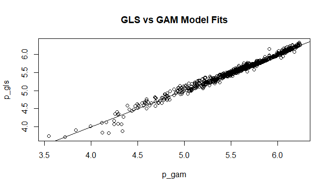

# Extracting Adjusted Means

We use the emmeans package to adjust predictions for other covariates.
However, the package is not behaving similarly for bothe the GAMM and
GLS fits.

## Simplest call for the GAMM fit

Here we need to provide information to allow emmeans to extract values.
The `quote()` function quotes it’s argument – that is, passes it on
unevaluated.

``` r
(f <- gam_fit$gam$formula)
#> log(Chl_Median) ~ Yearf + wlPrecip + DOY + te(lPrecip, lD_Median)
```

``` r
t1 <- emmeans(gam_fit, ~Yearf, data = the_data)
t1
#>  Yearf emmean     SE  df lower.CL upper.CL
#>  2015    5.29 0.0867 774     5.12     5.46
#>  2016    5.83 0.0699 774     5.69     5.97
#>  2017    5.38 0.0765 774     5.23     5.53
#>  2018    5.62 0.0739 774     5.47     5.76
#> 
#> Confidence level used: 0.95
```

We really want all of this back-transformed to raw concentrations, not
in log scale. For some reason, emmeans is not providing the back
transform when the parameter `type = 'response'` is set. (So we removed
the parameter while we work this out.)

Working through the emmeans ‘transformations’ vignette points the way.
We need to explicitly tell `emmeans()` about the transformation. We do
that by creating a reference grid and updating it directly.

``` r
my_rg <- update(ref_grid(gam_fit, data = the_data),
                tran = 'log')
my_rg
#> 'emmGrid' object with variables:
#>     Yearf = 2015, 2016, 2017, 2018
#>     wlPrecip = 1.9049
#>     DOY = 203.41
#>     lPrecip = 0.55493
#>     lD_Median = 0.2011
#> Transformation: "log"
```

``` r
tt1 <- emmeans(my_rg, "Yearf", type = 'response')
summary(tt1)
#>  Yearf response   SE  df lower.CL upper.CL
#>  2015       198 17.2 774      167      235
#>  2016       340 23.8 774      297      390
#>  2017       218 16.7 774      188      253
#>  2018       275 20.3 774      238      318
#> 
#> Confidence level used: 0.95 
#> Intervals are back-transformed from the log scale
```

But notice that the grid locations are perhaps not what we want. In
particular, this has estimated marginal means for a day with the
following properties:

  - Precipitation of about 2.3 mm,  
  - (Weighted) recent precipitation of a whopping 51.28,  
  - estimates stream depth of 0.22 meters.  
  - all for the 203rd day of the year.

These are selected based on MEAN values, and for the types of skewed
predictors we have, we are better off working with medians. While we are
at it, we generate marginal means for the 200th day of the year, which
is either July 1 or 2, depending on whrether it’s a leap year or not.

We can check the Julian Day of the first of July (2020, a leap year) as
follows:

``` r
format(as.Date('01-07-2020'), '%j')
#> [1] "201"
```

``` r
my_rg_2 <- update(ref_grid(gam_fit, data = the_data,
                           cov.reduce=median,
                           at = list(DOY = 200)),
                tran = 'log')
my_rg_2
#> 'emmGrid' object with variables:
#>     Yearf = 2015, 2016, 2017, 2018
#>     wlPrecip = 1.6093
#>     DOY = 200
#>     lPrecip = 0
#>     lD_Median = 0.16805
#> Transformation: "log"
```

``` r
tt2 <- emmeans(my_rg_2, "Yearf", type = 'response')
summary(tt2)
#>  Yearf response   SE  df lower.CL upper.CL
#>  2015       222 19.0 774      188      263
#>  2016       382 26.2 774      333      437
#>  2017       244 18.6 774      210      284
#>  2018       308 22.5 774      267      356
#> 
#> Confidence level used: 0.95 
#> Intervals are back-transformed from the log scale
```

Thus under “median” conditions, we expect slightly higher chloride than
under mean conditions.

We can even specify the locations for estimating marginal means entirely
manually.

``` r
my_rg_3 <- update(ref_grid(gam_fit, 
                         at = list(Yearf =c(2015, 2016, 2017, 2018),
                                   wlPrecip = log(10),   # half a cm of weighted rainfall
                                   DOY = 200,  # June 30th in leap years.
                                   lPrecip = 0,   # NO rain today.
                                   lD_Median = 0.2),
                         data = the_data),
                tran = 'log')
my_rg_3
#> 'emmGrid' object with variables:
#>     Yearf = 2015, 2016, 2017, 2018
#>     wlPrecip = 2.3026
#>     DOY = 200
#>     lPrecip = 0
#>     lD_Median = 0.2
#> Transformation: "log"
```

``` r
tt3 <- emmeans(my_rg_3, "Yearf", type = 'response')
summary(tt3)
#>  Yearf response   SE  df lower.CL upper.CL
#>   2015      192 16.6 774      162      228
#>   2016      330 23.0 774      288      378
#>   2017      211 16.1 774      182      245
#>   2018      267 19.5 774      231      308
#> 
#> Confidence level used: 0.95 
#> Intervals are back-transformed from the log scale
```

## Some Graphics Alternatives

``` r
plot(tt2, horizontal = FALSE, comparisons=TRUE) + 
  xlab('Year')+ ylab('Chlorides (mg/l)') + ggtitle('Adjusted Geometric Means') +
  theme_minimal()
```

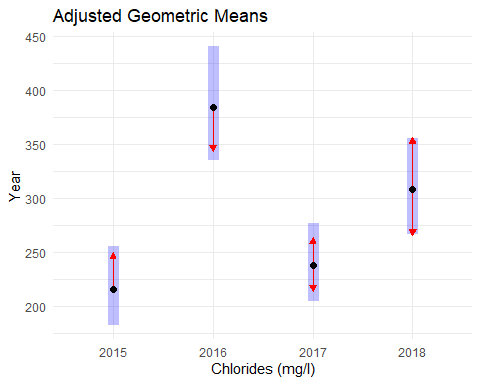

``` r
pwpm(tt2)
#>       2015   2016   2017   2018
#> 2015 [222] <.0001 0.8222 0.0217
#> 2016 0.582  [382] <.0001 0.1404
#> 2017 0.910  1.563  [244] 0.0680
#> 2018 0.721  1.237  0.792  [308]
#> 
#> Row and column labels: Yearf
#> Upper triangle: P values   adjust = "tukey"
#> Diagonal: [Estimates] (response)   type = "response"
#> Lower triangle: Comparisons (ratio)   earlier vs. later
pwpp(tt2)
```

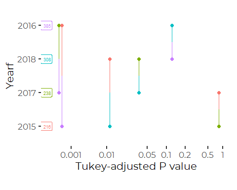

## An Alternative Model

We generate emmeans from the GLS model as well, just to demonstrate that
for our purposes, the results are similar.

``` r
 emmeans(gls_fit, ~Yearf, mode = "df.error", 
              cov.reduce=median, at = list(DOY = 200),
              type = 'response')
#>  Yearf response   SE  df lower.CL upper.CL
#>  2015       225 17.6 785      193      262
#>  2016       384 24.4 785      339      435
#>  2017       238 17.1 785      206      274
#>  2018       300 20.1 785      263      343
#> 
#> Degrees-of-freedom method: df.error 
#> Confidence level used: 0.95 
#> Intervals are back-transformed from the log scale
```

Note that the degrees of freedom are calculated differently, but the
standard errors and confidence intervals are not very different.

# Decomposing Model Results

We want to decompose the results into: 0. The Raw data 1. A YEAR BY YEAR
component 2. A DAY OF YEAR component 2. A WEATHER component, including
rainfall and flow 4. An ERROR Term.

The challenge here is that we want to use the ggplot facet system, which
requires a tidy dataset

The way to do this is to fit sequentially simpler models, on the
residuals of prior models.

We have just completed the Year analysis, so we rely on that.

## Raw Data

We center the data before plotting….

``` r
plotdat <- the_data %>%
  select(sdate, Chl_Median, lPrecip, wlPrecip, lD_Median, Yearf, DOY) %>%
  filter(complete.cases(.))  %>%    # We don't need the missing values anymore.
  mutate(cObserved = scale(Chl_Median, center=TRUE, scale=FALSE))
```

## Year by Year

``` r
(q <- summary(tt2))
#>  Yearf response   SE  df lower.CL upper.CL
#>  2015       222 19.0 774      188      263
#>  2016       382 26.2 774      333      437
#>  2017       244 18.6 774      210      284
#>  2018       308 22.5 774      267      356
#> 
#> Confidence level used: 0.95 
#> Intervals are back-transformed from the log scale
```

``` r
plotdat <- plotdat %>%
  mutate(YrAdjust = q[match(Yearf, q$Yearf), 2],
         aChl_Median = Chl_Median - YrAdjust,
         cYrAdjust = scale(YrAdjust, center=TRUE, scale=FALSE))
```

## Day of Year….

The way we do that is to fit another model, to the annually adjusted
chloride data, extract the emmeans, and continue. Day of year term
should be linear, since that is what we fitted, above.

But I’m having trouble fitting these data to the model we used before,
because of convergence issues.

gamm(log(Chl\_Median) \~ Yearf + wlPrecip + DOY + te(lPrecip,
lD\_Median),

``` r
doy_fit <- gamm(log(aChl_Median) ~ 
                    wlPrecip +
                    DOY +
                    te(lPrecip, lD_Median),
                data = plotdat, 
               na.action=na.omit, 
               method = 'REML',
                correlation=corAR1())
#> Warning in log(aChl_Median): NaNs produced

#> Warning in log(aChl_Median): NaNs produced
```

``` r
my_rg_5 <-  update(ref_grid(doy_fit, data = the_data,
                            cov.keep = 'DOY',
                            cov.reduce=median),
                tran = 'log')
```

``` r
t5 <- emmeans(my_rg_5, ~ DOY, type='response')
```

``` r
q <- summary(t5)

plotdat <- plotdat %>%
  mutate(DOYAdjust = q[match(DOY, q$DOY),2],
         aChl_Median = aChl_Median - DOYAdjust,
         cDOYAdjust = scale(DOYAdjust, center=TRUE, scale=FALSE))
```

## The Weather Term

``` r
weather_fit <- gamm(aChl_Median ~ 
                    wlPrecip +
                    te(lPrecip, lD_Median),
               data = plotdat, 
               na.action=na.omit, 
               method = 'REML',
               correlation=corAR1())
```

``` r
q = predict(weather_fit$gam)
r = resid(weather_fit$gam)

plotdat <- plotdat %>%
  mutate(WeatherAdjust = q,
         cWeatherAdjust = scale(DOYAdjust, center=TRUE, scale=FALSE),
         Residual = r)
```

## Graphic Decomposition of the Time Series

``` r

pivot_longer(plotdat, c(cObserved, cYrAdjust, cDOYAdjust, 
                        cWeatherAdjust, Residual), 
             names_to = 'kind', 
             values_to = 'value') %>%
  mutate(kind = factor(kind, 
                       levels = c('cObserved', 'cYrAdjust', 'cDOYAdjust', 
                        'cWeatherAdjust', 'Residual'),
                       labels = c('Observed', 'Year', 'Day of Year', 
                        'Weather', 'Residual'),)) %>%

ggplot( aes(sdate,value, color=kind)) + 
  geom_point() +
  # geom_smooth(aes(group = Yearf), se = FALSE, color = 'black', method = 'gam',
  #           formula = y~ s(x, bs = 'cs', k=3)) +
  facet_wrap(~kind, nrow=5, scales = 'fixed') +
  ylab('Chlorides (mg/l)') +
  xlab('Date') +
  ggtitle('Adjusted Geometric Means') +
  theme_cbep(base_size = 12)
```

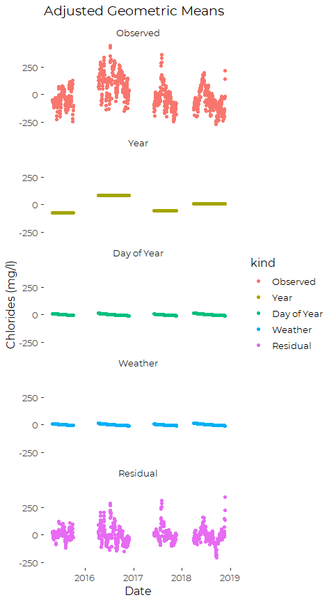
